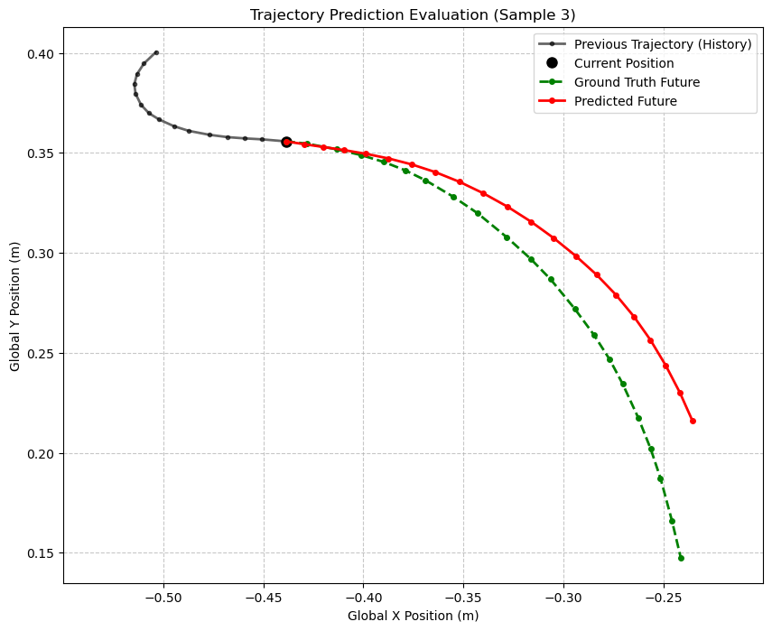

# System Identification of a Omnidirectional robot

Tiny experiments for learning and evaluating robot dynamics models.

## Problem Description

We aim to learn a neural network-based dynamics model for robot simulation. The robot state at time $t$ is represented as $s_t \in \mathbb{R}^n$, typically including position $(x, y)$ and orientation $\theta$. The control input is denoted as $u_t \in \mathbb{R}^m$, representing motor commands or velocities.

The objective is to learn a function $f_\theta: \mathbb{R}^{n+m} \to \mathbb{R}^n$ that approximates the true dynamics:

$$s_{t+1} = f_\theta(s_t, u_t) + \epsilon$$

where $\theta$ represents the neural network parameters and $\epsilon$ represents modeling error. Given a dataset $\mathcal{D} = \{(s_t^{(i)}, u_t^{(i)}, s_{t+1}^{(i)})\}_{i=1}^N$ of state transitions, we minimize:

$$\mathcal{L}(\theta) = \frac{1}{N}\sum_{i=1}^{N} \ell(s_{t+1}^{(i)}, f_\theta(s_t^{(i)}, u_t^{(i)}))$$

where $\ell$ is a suitable loss function measuring the discrepancy between predicted and actual next states.

## Training

The autoregressive trainer learns a forward dynamics model using sequential prediction. Given a state $s_t$ and control input $u_t$, the model learns to predict the next state $s_{t+1}$:

$$s_{t+1} = f(s_t, u_t)$$

During training, the model is unrolled over a prediction horizon $H$, producing predictions $\hat{s}_{t+1}, \hat{s}_{t+2}, \ldots, \hat{s}_{t+H}$. The loss is computed against ground truth states and backpropagated through the entire trajectory to update the network parameters.

## Evaluation

Model evaluation is performed by rolling out the learned dynamics model autoregressively using a sequence of control inputs. The model's predictions are compared against ground truth trajectories using metrics such as Mean Euclidean Distance Error (MEDE) for position accuracy and Mean Absolute Circular Error (MACE) for orientation accuracy.

STOP THE AUOREGRESSIVE LOOP WHEN THE LOSS IS TO LARGE THIS IS TO AVOID UNNECESARY.